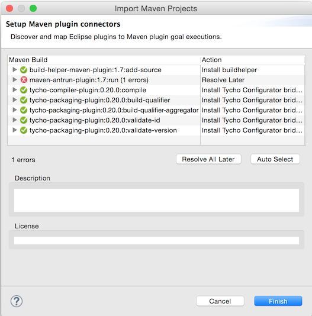
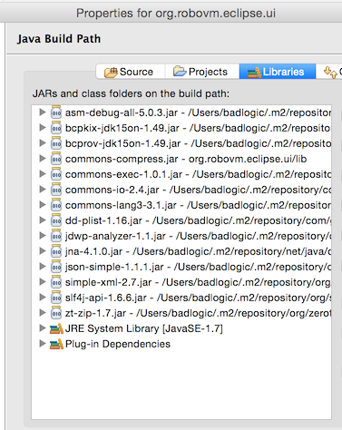
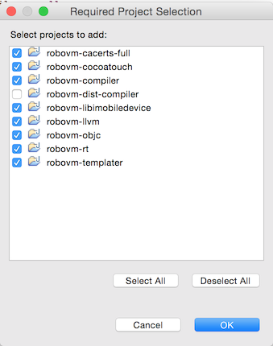
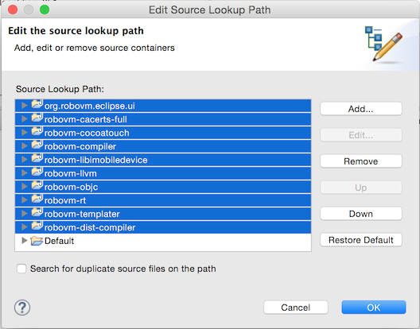

# Hacking on RoboVM
RoboVM is open-source, meaning you can check out its source, hack it, and submit bug fixes and enhancements. All our open-source code can be found on [Github](https://github.com/robovm/).

Note that some parts of RoboVM are closed source, such as the debugger and the Interface Builder integration. Changes to these can only be made by the RoboVM team itself.

## Contributor License Agreement
We request that all contributors of ideas, code, or documentation to the RoboVM project complete, sign, and submit an [Individual Contributor License Agreement (CLA)](http://download.robovm.org/cla/RoboVM-ICLA.pdf). The purpose of this agreement is to clearly define the terms under which intellectual property has been contributed to the project.

For a corporation that has assigned employees to work on RoboVM, a [Corporate CLA (CCLA)](http://download.robovm.org/cla/RoboVM-CCLA.pdf) is available for contributing intellectual property via the corporation, that may have been assigned as part of an employment agreement. Note that a Corporate CLA does not remove the need for every developer to sign their own CLA as an individual, to cover any of their contributions which are not owned by the corporation signing the CCLA.

Print the CLA, sign it and scan it (or use a camera to photograph it) and e-mail it to [hello@robovm.com](mailto:hello@robovm.com). Include your GitHub user name in the e-mail.

## Formatting Rules
If you work on Java code of RoboVM, please use this [Eclipse formatter](https://github.com/robovm/robovm/blob/master/formatter.xml) to format your contributions. You can use the formatter with IntelliJ IDEA as well. Just install the [Eclipse Formatter Plugin for IntelliJ IDEA](https://plugins.jetbrains.com/plugin/6546).

We use CamelCase for type, function and variable names. We use only spaces, and indent 4 spaces at a time. No newline before the start brace of blocks. American English spelling is preferred (e.g. ‘color’ instead of ‘colour’).

For C/C++ code contributions please use coding style similar to the Java coding conventions described above. Have a look at the code in `vm/core/` if unsure.

## Setting up Your Development Environment
In this article, we'll cover how to work on RoboVM via Eclipse on Mac OS X. It is possible to use [IntelliJ IDEA](https://github.com/robovm/robovm-idea) or [Linux](https://github.com/robovm/robovm/wiki/Hacking-on-RoboVM) as well, but the process is a little more involved.

For development on Mac OS X via Eclipse, you need to install:

* [Brew](http://brew.sh/), a package manager for Mac OS X
* [CMake](http://www.cmake.org/) +2.8.8 (`brew install cmake`)
* JDK +7, both [Oracle JDK](http://www.oracle.com/technetwork/java/javase/downloads/index.html) and [OpenJDK](http://openjdk.java.net/) will work
* Maven +3.x (`brew install maven`)
* [Xcode](https://itunes.apple.com/us/app/xcode/id497799835?mt=12), install it via the Mac App Store
* Git & Clang will be installed when you install Xcode
* [Eclipse Luna or newer](http://www.eclipse.org/downloads/), download the *Eclipse IDE for Java EE Developers* package

>NOTE: You **must** use the **Eclipse IDE for Java EE Developers** package, otherwise you'll run into all kinds of issues regarding plugins and m2e.

Once you have installed all of the above, follow these steps:

1. Set the JAVA_HOME environment variable to point to your JDK root directory (e.g. `/Library/Java/JavaVirtualMachines/jdk1.8.0_05.jdk/Contents/Home`)
2. Open Xcode, agree to the Xcode terms and make sure the command line utilities are properly installed

## Checking out the Code
RoboVM is composed of multiple parts, each contained in separate [Github repositories](https://github.com/robovm). When hacking on RoboVM, you are interested in three of these repositories:

1. [robovm](https://github.com/robovm/robovm), contains the compiler, class library and native VM code.
2. [robovm-templates](https://github.com/robovm/robovm-templates), contains RoboVM template projects and a class to create those templates on disk
2. [robovm-dist](https://github.com/robovm/robovm-dist), packages up the compiler and creates a `tar.gz` package. This can be used for RoboVM command line development.
3. [robovm-eclipse](https://github.com/robovm/robovm-eclipse), the RoboVM Eclipse plugin. Uses the output of the `robovm-dist` project.

Let's checkout the compiler, the distribution project, and the Eclipse plugin project. In the terminal:

```bash
# this is going to be our workspace directory later on
mkdir robovm-workspace
cd robovm-workspace
# clone the repositories into the workspace
git clone https://github.com/robovm/robovm.git
git clone https://github.com/robovm/robovm-templates.git
git clone https://github.com/robovm/robovm-dist.git
git clone https://github.com/robovm/robovm-eclipse.git
```

>NOTE: If you plan on sending us patches for RoboVM, fork these three repositories on Github and clone your forks instead! See this [guide about keeping your forks in synch](https://help.github.com/articles/configuring-a-remote-for-a-fork/) with our master repositories (upstream).

>NOTE: When packaing a custom RoboVM distribution via the `robovm-dist` project, the distribution Maven assembly will copy the binaries from `robovm/vm/binaries`, not `robovm/vm/target/binaries`. Invoke `robovm/vm/copy-binaries.sh` first. That will copy your custom native binaries from `robovm/vm/target/binaries` to `robovm/vm/binaries` for distribution.

## Building the native VM libraries
RoboVM has quite a bit of native C/C++ code in it. Before you can start working on RoboVM, you'll first have to build this native code locally:

```
cd robovm/vm
./build.sh
```

This will take quite a while, as it build release and debug builds of all native libraries for all platforms and CPU architectures (Mac OS X, iOS Simulator, iOS Device, x86, x86_64, Thumb, ARM64).

The resulting binaries will end up in the folder `robovm/vm/target/binaries`.

>NOTE: if you don't work on the native code, call the `robovm/vm/fetch-binaries.sh` script. Then copy the folders in `robovm/vm/binaries/` over to `robovm/vm/target/`, so you end up with a `robovm/vm/target/binaries/` folder. This will download the latest snapshot native binaries from our build servers. Repeat this process every time you update your fork with upstream.

## Building on the Command Line via Maven
Building via Maven is pretty simple:

```
cd robovm/
mvn clean install
```

This will compile the RoboVM compiler, the class runtime library, the ObjC runtime library and the CocoaTouch bindings and put them into your local Maven repository.


```
cd ../robovm-templates/
mvn clean install
```

This will compile the RoboVM project templates (and Maven archetypes) as well as the templater library used to create those templates on disk.

```
cd ../robovm-dist
mvn clean install
```

This will create a `tar.gz` file in `robovm-dist/package/target` that you can use to work with RoboVM from the command line.

```
cd ../robovm-eclipse
mvn clean install
```

This will take the distribution tar.gz and package it with the RoboVM Eclipse plugin (in `robovm-eclipse/ui/libs`). It will also create an Eclipse update site locally at which you can point Eclipse to install the plugin. You don't really need to do this, as the next section will explain.

>NOTE: the projects have to be build in this order!

## Importing to Eclipse
The RoboVM projects we build in the last section can also be directly imported into Eclipse:

1. Open Eclipse and set the workspace directory to `robovm-workspace`
3. Click *Browse* and select the `robovm-workspace` directory. You should see this selection of projects:
   
4. Click *Finish*
5. Eclipse will ask you to install a variety of m2e-connectors. Simply click *Finish* and *OK* in the dialogs that pop up. This will install all the required connectors
   

>NOTE: If the last step fails for some reason, install the connectors manually. First, delete the (hidden) `.metadata` folder in `robovm-workspace`. Open up Eclipse again, and import the projects as described above. In step 5, click `Cancel`. Next go to `Eclipse -> Preferences`. Select *Maven -> Discovery* from the side bar. Click on *Open Catalog*. Enter *buildhelper*  in the search box, then install the buildhelper connector. Repeat this with the search term *tycho* and install the Tycho Configurator connector.

>NOTE: the *org.robovm.eclipse.feature*  project will still have an error after going through all these steps above. Sadly, there's no m2e connector for the Maven Ant plugin. The error is not a problem for development though.

## Projects Walkthrough
Before we try to run and debug anything, let's look at all these projects:

* *org.robovm.eclipse.feature*, *org.robovm.eclipse.ui* and *org.robovm.eclipse.update-site* contain the Eclipse plugin code and configuration. The UI project contains the actual code. Interesting classes are 'RoboVMPlugin', the main entry point of the plugin, and AbstractLaunchConfigurationDelegate', responsible firing of compilation when a run configuration is being executed.
* *robovm-cacerts* contains various certificate related things and does usually not need to be touched
* *robovm-compiler* is the workhorse. It provides the compiler infrastructur. `AppCompiler` is a good class to start looking at.
* *robovm-libimobiledevice*  contains bindings to [libimobiledevice](http://www.libimobiledevice.org/), a library that lets us deploy apps to a connected device. `AppLauncher` covers most of the work this project provides.
* *robovm-llvm* contains bindings for [LLVM](http://www.llvm.org), the compiler infrastructure we use to translate Java byte code to machine code.
* *robovm-rt*  contains the class library of RoboVM which is based on Android's class library.
* *robovm-objc* contains the Objective-C bridge of RoboVM called Bro (pronounced like *brew*, swedish for bridge)
* *robovm-cocoatouch* contains the bindings for iOS APIs. These are generated semi-automatically.
* *robovm-xxx-template* are RoboVM project templates 
* *robovm-templater* is a project that depends on the templates and knows how to extract them to disk and replace values in files like robovm.xml etc. `Templater` is the class that does this magic.

## Running & Debugging
With our current setup we can already run and debug the RoboVM Eclipse plugin:

* Right click the *org.robovm.eclipse.ui*  project, select *Run As -> Eclipse Application*. This creates a new run configuration and launches an Eclipse instance with the RoboVM Eclipsep lugin installed.
* Play around a little, create a new RoboVM iOS project, compile it, etc.

However, if you set a breakpoint in say one of the compiler project's classes, it won't get hit. Also, if you modify either the Java sources of the other projects, or the native code in `robovm/vm`, the changes will not be reflected in the RoboVM Eclipse plugin project.

This is due to the Eclipse plugin project setup. It doesn't directly reference the other projects in the workspace, but instead references JAR and tar.gz files in the libs/ folder


If you make a change to the Java or native code of any of RoboVM's parts, you will need to build the projects with Maven on the command as described earlier. 

This is a terribly inefficient way to test changes, so let's fix this.

## Working with Locally Compiled Native Libraries - ROBOVM_DEV_ROOT
As a first step, let's fix the native library issue:

1. Open the run configuration for the plugin project you just created.
2. Go to the *Environment* tab and add a new variable called `ROBOVM_DEV_ROOT`. It should point to the `robovm` project's directory
   

If you run the run configuration now, then the native libraries are directly pulled from `robovm/vm/target/binaries` instead of `robovm/vm/binaries`. This means that if you make modification to the native code of RoboVM, it will be automatically picked up.

You can verify this by starting the Eclipse instance via the run configuration and compiling a RoboVM project. The RoboVM console window shows you the linker command, which includes the paths to all linked native libraries:

```
5/12/15 7:19:18 PM: [DEBUG] /Applications/Xcode.app/Contents/Developer/Toolchains/XcodeDefault.xctoolchain/usr/bin/clang++ -o /Users/badlogic/Desktop/runtime-EclipseApplication/.metadata/.plugins/org.robovm.eclipse.ui/build/test/test/ios/x86/Test -arch i386 -Wl,-filelist,/Users/badlogic/Desktop/runtime-EclipseApplication/.metadata/.plugins/org.robovm.eclipse.ui/build/test/test/ios/x86/objects -L /Users/badlogic/Desktop/robovm-workspace/robovm/vm/target/binaries/ios/x86 -ObjC -exported_symbols_list /Users/badlogic/Desktop/runtime-EclipseApplication/.metadata/.plugins/org.robovm.eclipse.ui/build/test/test/ios/x86/exported_symbols -Wl,-no_implicit_dylibs -Wl,-dead_strip -mios-simulator-version-min=8.0 -Wl,-no_pie -stdlib=libstdc++ -isysroot /Applications/Xcode.app/Contents/Developer/Platforms/iPhoneSimulator.platform/Developer/SDKs/iPhoneSimulator8.3.sdk -lrobovm-bc -force_load /Users/badlogic/Desktop/robovm-workspace/robovm/vm/target/binaries/ios/x86/librobovm-rt.a -lrobovm-debug -lrobovm-core -lgc -lpthread -ldl -lm -liconv -lsqlite3 -framework Foundation -framework MobileCoreServices -framework UIKit
```

Note the `-L` parameter which now points at the `robovm/vm/target/binaries` folder instead of the `robovm/vm/binaries` folder.

The `ROBOVM_DEV_ROOT` variable will also cause RoboVM to dump intermediate files into the RoboVM cache (`~/.robovm/`) for each class file that it compiles. This lets you inspect the generated LLVM IR files (`.ll`, `.bc`) as well as the generated assembler output (`.s`).

Remember that we also compiled the native libraries in debug mode. To make RoboVM use these instead of the release mode binaries, we can add a VM argument to the run configuration (`-Drobovm.useDebugLibs=true`):


Checking the linker command again:

```
5/12/15 7:27:40 PM: [DEBUG] /Applications/Xcode.app/Contents/Developer/Toolchains/XcodeDefault.xctoolchain/usr/bin/clang++ -o /Users/badlogic/Desktop/runtime-EclipseApplication/.metadata/.plugins/org.robovm.eclipse.ui/build/test/test/ios/x86/Test -arch i386 -Wl,-filelist,/Users/badlogic/Desktop/runtime-EclipseApplication/.metadata/.plugins/org.robovm.eclipse.ui/build/test/test/ios/x86/objects -L /Users/badlogic/Desktop/robovm-workspace/robovm/vm/target/binaries/ios/x86 -ObjC -exported_symbols_list /Users/badlogic/Desktop/runtime-EclipseApplication/.metadata/.plugins/org.robovm.eclipse.ui/build/test/test/ios/x86/exported_symbols -Wl,-no_implicit_dylibs -Wl,-dead_strip -mios-simulator-version-min=8.0 -Wl,-no_pie -stdlib=libstdc++ -isysroot /Applications/Xcode.app/Contents/Developer/Platforms/iPhoneSimulator.platform/Developer/SDKs/iPhoneSimulator8.3.sdk -lrobovm-bc-dbg -force_load /Users/badlogic/Desktop/robovm-workspace/robovm/vm/target/binaries/ios/x86/librobovm-rt-dbg.a -lrobovm-debug-dbg -lrobovm-core-dbg -lgc-dbg -lpthread -ldl -lm -liconv -lsqlite3 -framework Foundation -framework MobileCoreServices -framework UIKit
```

We now see that instead of e.g. `librobovm-rt.a` we now link `librobovm-rt-dbg.a`. This means you can **attach Xcode or LLDB to the running RoboVM application (console or simulator) and debug the native code directly**.

### Native Code Workflow
1. Start the Eclipse instance via the run configuration, make sure `ROBOVM_DEV_ROOT` and `robovm.debugLibs` are set. Leave the instance running.
1. Edit the native code in `robovm/vm` or `robovm/rt` with an editor/IDE of your choice
2. Compile the changes via `robovm/vm/build.sh`
3. Compile a RoboVM project in the Eclipse instance to test your native code changes
4. Attach Xcode or LLDB to the RoboVM app while it is running. Note that you can start RoboVM console apps directly via LLDB to catch early native code execution.

Debugging native code on a device is sadly a lot more involved and won't be described here. In general, testing on the console and simulator are usually enough to smash native code bugs. If not, call a professional.

## Wiring up the Eclipse projects
So far we know how to test native code changes. On the Java-side of things, we can only set breakpoints in the plugin's source code, but not in the compiler sources. To fix this, we need to

1. Let the plugin UI project depend on the other projects in the workspace.
2. Modify temporarily modify the `MANIFEST.MF` file of the in `robovm-eclipse/ui/META-INF/`.

You will get a few compilation errors. To fix these, we also need to modify the MANIFEST.XML file:

1. Open the `MANIFEST.XML` file in the *org.robovm.eclipse.ui* project's `META-INF` folder
2. In the editor window, select the `MANIFEST.XML` tab at the bottom of the editor.
3. Replace the content of the file with the following, make sure to rewrite the absolute paths for your file system!

```
Manifest-Version: 1.0
Bundle-ActivationPolicy: lazy
Bundle-Name: RoboVM Eclipse IDE Plugin
Bundle-RequiredExecutionEnvironment: JavaSE-1.7
Require-Bundle: org.eclipse.core.runtime,
 org.eclipse.ui,
 org.eclipse.jdt.ui,
 org.eclipse.jdt.core,
 org.eclipse.core.resources,
 org.eclipse.ui.console,
 org.eclipse.ui.ide,
 org.eclipse.debug.core,
 org.eclipse.debug.ui,
 org.eclipse.jdt.debug,
 org.eclipse.jdt.debug.ui,
 org.eclipse.jdt.launching,
 org.eclipse.jdt.junit,
 org.eclipse.jdt.junit.runtime,
 org.eclipse.jdt.junit4.runtime
Bundle-Version: 1.2.1.qualifier
Bundle-ManifestVersion: 2
Bundle-Activator: org.robovm.eclipse.RoboVMPlugin
Bundle-SymbolicName: org.robovm.eclipse.ui;singleton:=true
Bundle-ClassPath: .,
 lib/commons-compress.jar,
 external:/Users/badlogic/.m2/repository/commons-io/commons-io/2.4/commons-io-2.4.jar,
 external:/Users/badlogic/.m2/repository/org/apache/commons/commons-exec/1.0.1/commons-exec-1.0.1.jar,
 external:/Users/badlogic/.m2/repository/org/apache/commons/commons-lang3/3.1/commons-lang3-3.1.jar,
 external:/Users/badlogic/.m2/repository/com/googlecode/plist/dd-plist/1.16/dd-plist-1.16.jar,
 external:/Users/badlogic/.m2/repository/org/simpleframework/simple-xml/2.7/simple-xml-2.7.jar,
 external:/Users/badlogic/.m2/repository/org/bouncycastle/bcpkix-jdk15on/1.49/bcpkix-jdk15on-1.49.jar,
 external:/Users/badlogic/.m2/repository/org/bouncycastle/bcprov-jdk15on/1.49/bcprov-jdk15on-1.49.jar,
 external:/Users/badlogic/.m2/repository/com/googlecode/json-simple/json-simple/1.1.1/json-simple-1.1.1.jar,
 external:/Users/badlogic/.m2/repository/org/ow2/asm/asm-debug-all/5.0.3/asm-debug-all-5.0.3.jar,
 external:/Users/badlogic/.m2/repository/org/zeroturnaround/zt-zip/1.7/zt-zip-1.7.jar,
 external:/Users/badlogic/.m2/repository/org/slf4j/slf4j-api/1.6.6/slf4j-api-1.6.6.jar,
 external:/Users/badlogic/.m2/repository/com/badlogicgames/jdwp-analyzer/1.1/jdwp-analyzer-1.1.jar,
 external:/Users/badlogic/.m2/repository/net/java/dev/jna/jna/4.1.0/jna-4.1.0.jar,
 external:/Users/badlogic/Desktop/robovm-workspace/robovm/rt/target/classes,
 external:/Users/badlogic/Desktop/robovm-workspace/robovm/libimobiledevice/target/classes,
 external:/Users/badlogic/Desktop/robovm-workspace/robovm/llvm/target/classes,
 external:/Users/badlogic/Desktop/robovm-workspace/robovm/compiler/target/classes,
 external:/Users/badlogic/Desktop/robovm-workspace/robovm-templates/templater/target/classes,
 external:/Users/badlogic/Desktop/robovm-workspace/robovm-templates/console/target/classes,
 external:/Users/badlogic/Desktop/robovm-workspace/robovm-templates/default/target/classes,
 external:/Users/badlogic/Desktop/robovm-workspace/robovm-templates/single-view/target/classes

```

This will make Eclipse resolve classes in these paths instead off fetching them from the JAR files in the `libs` folder.

Next, we need to wire up all the projects and JARs as dependencies of our plugin project.

1. Right-click the plugin UI project, select *Properties*
2. In the side-bar, select *Java Build Path*, then select the *Libraries* tab
3. Remove all JARs except for the *commons-compress.jar*
4. Add each JAR referenced in the `MANIFEST.XML` file as an external JAR. Copy the path of each entry, then click `Add external JAR`, then hit *CMD + G* to directly enter the absolute path of the JAR. You should end up with this:
   
5. Select the *Projects* tab
3. Click *Add* and add all projects except the *robovm-dist-compiler* project.
   
6. Close the dialog

You can now set a breakpoint in the compiler sources as well. Let's try that:

1. Open `AppCompiler.java` in the *robovm-compiler* project.
2. Set a breakpoint in the `AppCompiler#compile()` method.
3. Run the Eclipse instance
4. Compile a RoboVM project
5. The breakpoint will be hit, but Eclipse doesn't know where to look for the source:
   
6. Click on the *Edit Source Lookup Path* button
7. Click *Add*, select *Java Project*, select all projects and click *OK*
   

Great, now you can debug all parts of RoboVM. You can also modify the source files while the Eclipse instance is running. Changes will be hotswapped automatically (within limits)!

## Workflow Java Source
1. Start the Eclipse instance, make sure `ROBOVM_DEV_ROOT` and `robovm.useDebugLibs` are set as described above
2. Create/import test RoboVM projects as you need them
3. Set breakpoints in the compiler sources in the parent Eclipse instance
4. Modify compiler sources on the fly and save them for code hotswapping

## Tests
RoboVM comes with a couple of test suites that make sure things don't break. Refer to this [wiki entry](https://github.com/robovm/robovm/wiki/Hacking-on-RoboVM#running-the-tests) for more information. Running this tests inside Eclipse is currently not possible.
