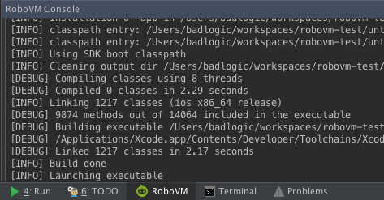
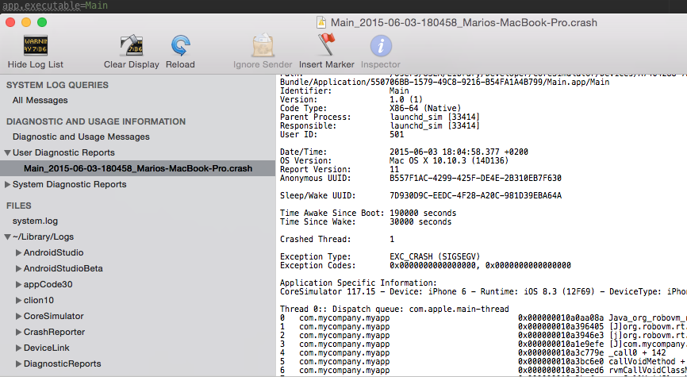

# Error Diagnostics
While developing your app with RoboVM, you might run into one or more of the following error scenarios.

* **IDE errors**, such as error dialogs.
* **Compilation errors**, your app didn't actually run.
* **Deployment errors** while launching your app on a simulator or device.
* **Crashes in Java code**, due to a bug or unhandled corner case.
* **Crashes in native C/Objective-C code**, due to a bug or unhandled corner case.

To identify the cause of an issue, you need to gather information for all these scenarios. Based on this information you can usually decide how to resolve the issue yourself or ask us for help.

## IDE Errors
RoboVM comes with dedicated plugins for both Eclipse and IntelliJ IDEA. While we take great care that these are as bug free as possible, you might still run into issues every now and then. This might involve things such as error dialogs popping up, Interface Builder integration not doing what it's supposed to do, and so on. In this case, collect the following information:

* The IDE logs
  * IntelliJ IDEA: *Help -> Show Log in Finder*.
  * Eclipse: `$WORKSPACE/.metadata/.log`.
* A screenshot of the fully expanded error dialog, if any.

## Compilation & Deployment Errors
When compiling your RoboVM app via an IDE, Maven or Gradle, you might run into compilation errors. This might be due to reasons such as your IDE/build system not having enough memory, a misconfigured `robovm.xml`, and so on.

When deploying your app to a simulator or device after compiling it, the deployment process might fail and your app may not be started. This might be due to reasons such as a device becoming disconnected or being locked, the simulator timing out after 30 seconds, and so on. In this case, collect the following information:

* Your `robovm.xml` file.
* IntelliJ IDEA: the full output of the RoboVM tools window.
  
* Eclipse: the full output of the RoboVM console window.
  
* Maven: the full output of the Maven build, using the command line options `-e -X`.
* Gradle: the full output of the Gradle build, using the command line options `-d -s`.

## Crashes in Java Code
Your code or 3rd party libraries you include in your RoboVM app may throw an unrecoverable exception, in which case your app will crash. The exception's stack trace will be reported to the console of your development environment. In this case, collect the following information:

* IntelliJ IDEA: the full output of the Debug/Run window for your app run.
  
* Eclipse: the full output of the console window for your app run.
  
* Maven: the output of the Maven build and subsequent information on the console.
* Gradle: the output of the Gradle build and subsequent information in the console.

## Crashes in Native Code
If your app crashes without any messages like Java stack traces, chances are it crashed in native C/Objective-C code that your RoboVM app uses. In this case, collect the following information:

* Simulator
  1. Open the *Console* app via Spotlight (CMD + Space, type `console`).
  2. Under `Diagnostics and Usage Information -> User Diagnostics Report`, locate the log file starting with your app's executable name as defined in `robovm.properties` with the time stamp that matches your failed app run.
    
  3. Grab the full log output.
* Device
  1. Open *Xcode* via Spotlight (CMD + Space, type `xcode`).
  2. Under *Window - >Devices* locate your device, then click *View Device Logs*
  3. Locate the log entry matching your app executable name as defined in `robovm.properties` and the time stamp of your failed app run.
     
  4. Grab the full log output.

## Reporting Your Problem
If the information you gathered isn't enough for you to solve the problem yourself, we are happy to assist on our [mailing list](https://groups.google.com/forum/#!forum/robovm). Users with a business or enterprise license may also contact us via our support mail at [hello@robovm.com](mailto:hello@robovm.com).

In order for us to be able to help you, we'll need the following information at a minimum:
1. A description of your development environment including your IDE, build system, RoboVM version, Xcode version, Mac OS X version.
2. A reproduction case that allows us to test the issue on our end.
3. All the information gathered as described above, including compiler/deployment output, Java stack traces, simulator & device logs.

