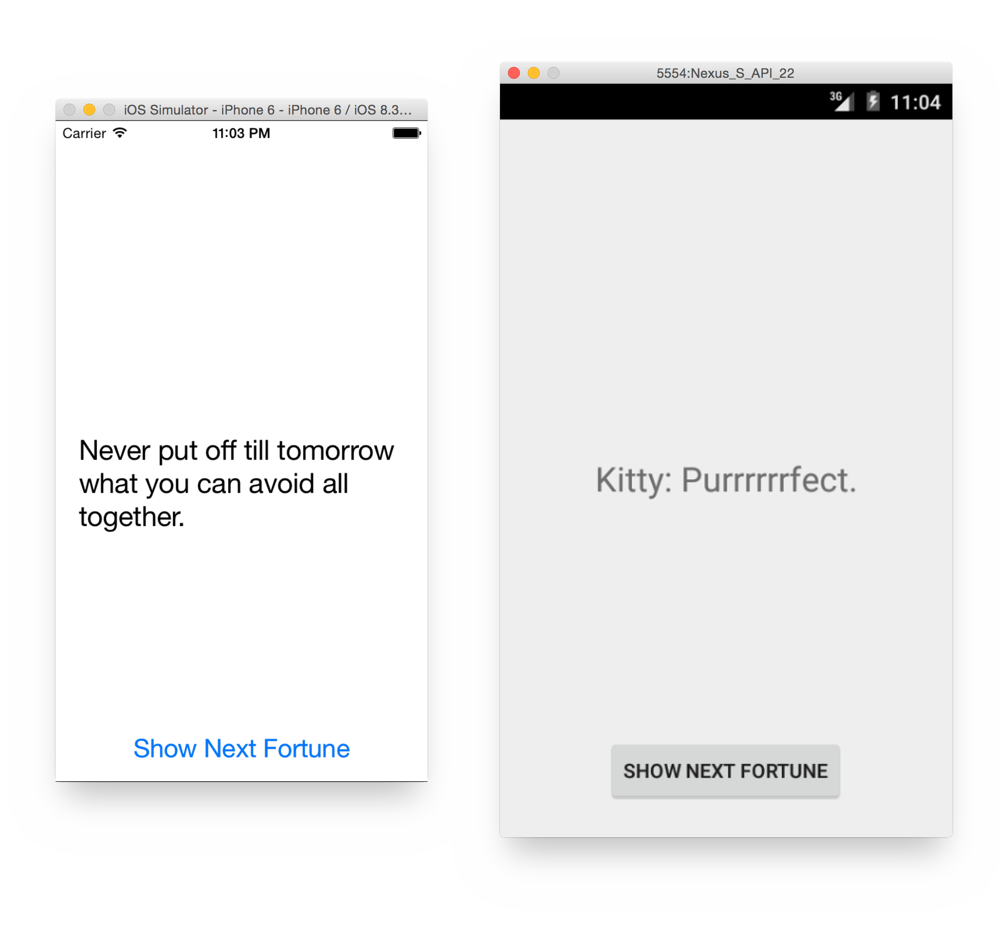
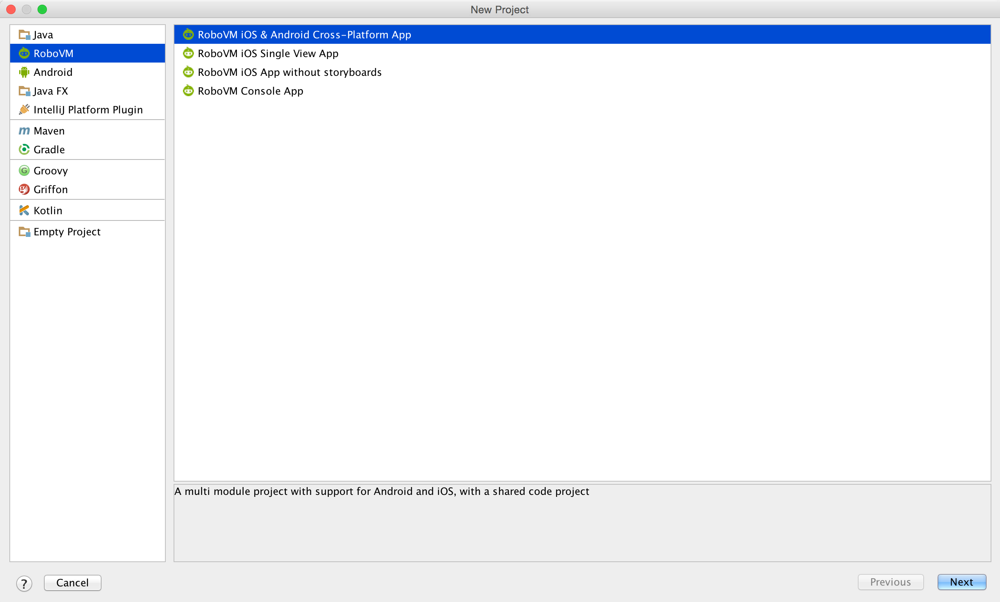

# Cross-Platform Basics

> NOTE: Although a valid license key is not needed for cross platform support, this tutorial makes use of Interface Builder integration which does. You can [sign up for a 14-day free trial](https://account.robovm.com/#/login) to test this feature.

<div class="video">
	<iframe frameborder="0" allowfullscreen src="https://www.youtube.com/embed/wP3ptAnVhQw?rel=0"></iframe>
</div>

The app we will be creating is a version of the [unix fortune](http://en.wikipedia.org/wiki/Fortune_%28Unix%29) program. Each time the user presses a button, a random fortune will be displayed. The UI will be intentionally simple in order to focus on strategies for cross-platform development.



## Project Setup

Open up RoboVM Studio (or IntelliJ) and choose "Start New Project...".

Under the RoboVM section choose the Cross Platform template. Fill in the details for your project in the next two steps as normal, and finally click the Finish button.



### Core

The core module should contain code that does not depend on the Android or iOS platforms. Typically, this will be comprised of the data and business logic layers.

Our model for the fortune app will start out with the simplest API possible, retrieving a random quote from a static database. In later sections we will expand that functionality to cover pulling new quotes from a web service.

In the process, you will learn about using popular libraries from the Android ecosystem in a cross-platform way.

The first thing we need to do is rename `CounterStore` to `FortuneStore` and replace the code with the following:

```java
package com.mycompany.fortune;

import java.util.Arrays;
import java.util.List;
import java.util.Random;

public class FortuneStore {
    private List<String> fortunes = Arrays.asList(
            "RoboVM rocks!",
            "RoboVM is awesome!"
    );

    private static Random rng = new Random();

    public String getFortune() {
        return fortunes.get(rng.nextInt(fortunes.size()));
    }
}
```

### Android UI

In order to design the Android UI, we will be taking advantage of the Android Designer within RoboVM Studio. In the project view, navigate to the android module > src > main > layout, and double click on `activity_fortune.xml`.

The cross platform template has already set us up with a `TextView` and a `Button`, so all we need to do is move the button to the bottom of the screen, and change its text to "Show Next Fortune!".

Also, we probably want to modify the __id__ property of the label and button to _fortuneTextView_ and _nextFortuneButton_ respectively.

Replace the contents of `FortuneActivity.java` under the `android` module with the following code.

```java
package com.mycompany.fortune;

import android.app.Activity;
import android.os.Bundle;
import android.view.View;
import android.widget.Button;
import android.widget.TextView;

public class FortuneActivity extends Activity {
    private FortuneStore fortuneStore = new FortuneStore(); // [:1:]

    @Override
    protected void onCreate(Bundle savedInstanceState) {
        super.onCreate(savedInstanceState);
        setContentView(R.layout.activity_fortune);

        final TextView fortuneTextView = (TextView) findViewById(R.id.fortuneTextView); // [:2:]
        final Button nextFortuneButton = (Button) findViewById(R.id.nextFortuneButton);

        nextFortuneButton.setOnClickListener(new View.OnClickListener() { // [:3:]
            @Override
            public void onClick(View view) {
                fortuneTextView.setText(fortuneStore.getFortune());
            }
        });

    }
}
```

[:1:] Instantiate the model class we created in the 'core' module.

[:2:] Obtain references by id to the text view and button we created in the Android Designer.

[:3:] Hook up the click event of the button to show a new quote from the model.

### iOS UI

In order to design the UI for the iOS app, we will make use of [Interface Builder](../ib-basics/ib-basics.md) from within Xcode. In the project view, navigate to the ios module > resources > Base.lproj, and double click on `Main.storyboard`.

There should already be a label and a button, which is exactly what we need, after some minor configuration.

* Click on the button and clear its constraints.
	* Change the text to be _Show Next Fortune_.
	* Resize it so all the text is shown.
	* Move it until the guides show it centered horizontally and next to the bottom.
	* Update the button's constraints.
* Click on the label and clear its constraints.
	* Make sure the label's text size is 24.
	* Change the alignment to 'left aligned'.
	* Increase the _Lines_ spinner to around 10.
	* Drag the bottom edge of the label down almost all the way to the bottom to resize it.
	* Update the label's constraints.

Finally, back in IntelliJ, update the contents of `MyViewController.java` in the ios module to the following code.

```java
package com.mycompany.fortune;

import org.robovm.apple.uikit.UILabel;
import org.robovm.apple.uikit.UIViewController;
import org.robovm.objc.annotation.CustomClass;
import org.robovm.objc.annotation.IBAction;
import org.robovm.objc.annotation.IBOutlet;

@CustomClass("MyViewController")
public class MyViewController extends UIViewController {
    private static FortuneStore fortuneStore = new FortuneStore(); // [:1:]
    private UILabel label;

    @IBOutlet // [:2:]
    public void setLabel(UILabel label) {
        this.label = label;
    }

    @IBAction
    private void clicked() { // [:3:]
        label.setText(fortuneStore.getFortune());
    }
}
```

[:1:] Instantiate the model class we created in the 'core' module.

[:2:] Obtain a reference to the label we created in Interface Builder.

[:3:] Hook up the IBAction of the button to set a new fortune on click.

## Web Request

At this point, we have a simple static database of fortunes, but in a typical application we would probably pull data from a web service. A commonly used library for making RESTful queries and parsing data into a Java object is [Retrofit](http://square.github.io/retrofit/).

### Configuration

First we will add Retrofit as a dependency to the core module by editing its `build.gradle` file:

```groovy
dependencies {
    testCompile group: 'junit', name: 'junit', version: '4.11'
    compile 'com.squareup.retrofit:retrofit:1.9.0'
}
```

For the android module we will need to edit the `src/main/AndroidManifest.xml` file to add a permission for using the internet. This line should go outside the `<application>` section.

```xml
<uses-permission android:name="android.permission.INTERNET" />
```

Finally, in the ios module we need to edit the `robovm.xml` file to make sure that RoboVM links in a few classes that Retrofit needs. See the [Configuration Reference](http://docs.robovm.com/configuration.html#-lt-forcelinkclasses-gt) for more details.

```xml
<forceLinkClasses>
	<pattern>com.android.okhttp.HttpHandler</pattern>
	<pattern>com.android.org.conscrypt.OpenSSLProvider</pattern>
	<pattern>com.android.org.conscrypt.JSSEProvider</pattern>
</forceLinkClasses>
```

### Fortune Client

We are going to use the [quotes subreddit](http://www.reddit.com/r/qutoes) as a web service that provides a simple API to query a random quote. Each subreddit can be queried just by adding '.json' to the end of the url. We will be using Retrofit to perform an asynchronous http GET, and parse the json result into a Java object.

We are going to create the simplest possible Retrofit client to access this service. Add a new class called `FortuneClient` to the core module and paste in the following code.

```java
package com.mycompany.fortune;

import retrofit.Callback;
import retrofit.RestAdapter;
import retrofit.RetrofitError;
import retrofit.client.Response;
import retrofit.http.GET;

import java.util.List;
import java.util.Random;

public class FortuneClient {
    private static final String API_URL = "http://www.reddit.com";

    static class Data { // [:1:]
        Data data;
        String title;
        List<Data> children;
    }

    private interface FortuneService { // [:2:]
        @GET("/r/quotes.json")
        void getFortune(Callback<Data> callback);
    }

    public static class OnFortuneListener { // [:3:]
        public void onFortune(String fortune) {
        }
    }

    private static Random rng = new Random();

    private FortuneService service;

    public FortuneClient() { // [:4:]
        RestAdapter adapter = new RestAdapter.Builder()
                .setEndpoint(API_URL)
                .build();

        service = adapter.create(FortuneService.class);
    }

    public void getFortune(final OnFortuneListener listener) {
        service.getFortune(new Callback<Data>() { // [:5:]
            @Override
            public void success(Data json, Response response) {
                List<Data> fortunes = json.data.children;
                Data fortune = fortunes.get(rng.nextInt(fortunes.size()));
                listener.onFortune(fortune.data.title);
            }

            @Override
            public void failure(RetrofitError error) {
                listener.onFortune(error.toString());
            }
        });
    }
}
```

[:1:] The json that returned is just a simple data object with an array of nested children data objects.

[:2:] Retrofit needs an interface with methods for each endpoint. There are many options available, but ours is very simple. If you provide a method that has a `Retrofit.Callback` argument, the http request will be asynchronous.

[:3:] For now, we provide a simple listener that the android and ios modules will be able to use to get the quotes when the request finishes.

[:4:] In the constructor we create a service using the `FortuneService` interface defined earlier, which can be reused by each request.

[:5:] For the sake of simplicity, we return the quote if the request is successful, and the error message if not.

### Android Updates

First we need to replace the `FortuneStore` in our activity with our new  `FortuneClient`:

```java
// private FortuneStore fortuneStore = new FortuneStore();
private FortuneClient fortuneClient = new FortuneClient();
```

And then update the button onClick listener to use the web client instead of accessing the local fortune store.

```java
nextFortuneButton.setOnClickListener(new View.OnClickListener() {
	@Override
	public void onClick(View view) {
		fortuneClient.getFortune(new FortuneClient.OnFortuneListener() {
			@Override
			public void onFortune(String fortune) {
				fortuneTextView.setText(fortune);
			}
		});
	}
});
```

### RoboVM Updates

Very much like in the Android activity, we need to add a `FortuneClient` to our view controller just after the `FortuneStore`:

```java
// private static FortuneStore fortuneStore = new FortuneStore();
private static FortuneClient fortuneClient = new FortuneClient();
```

The button click will be handled pretty much like on Android as well, accept Retrofit does not yet have direct support for RoboVM. On Android, the callback defaults to being called on the main UI thread, but on iOS (for now at least) the callback will most likely be called on the same thread used to make the http request.

In order to update the UI on the main thread, we will use an iOS feature called the `DispatchQueue`. Change the 'clicked' method and add the following 'setFortune' method to our view controller.

```java
@IBAction
private void clicked() {
	fortuneClient.getFortune(new FortuneClient.OnFortuneListener() {
		@Override
		public void onFortune(String fortune) {
			setFortune(fortune);
		}
	});
}

private void setFortune(String fortune) {
	DispatchQueue.getMainQueue().sync(new Runnable() {
		@Override
		public void run() {
			label.setText(fortune);
		}
	});
}
```

> INFO: When you run the app in the simulator now, you may see warnings when the button is clicked that some classes are missing. Retrofit will use certain libraries if they are present, and it looks these up at runtime using reflection. These can be ignored for now, but you may need to add these to the `forceLinkClasses` section of the robovm.xml in the future.

### Future Work

At this point we have a working, if somewhat simple, networked fortune app. There are many topics we haven't discussed, like storing our favorite quotes to the FortuneStore, serializing the store to disc in a cross-platform way.

We will be covering those topics and more in future tutorials!

## Conclusion

With RoboVM you can use Native UX and platform libraries, at native speeds, while also staying within the comfort of the tools and JVM ecosystem that you already know. Large portions of code can now be shared between your iOS and Android app, and some libraries from the Android community already work with very little effort on your part.
