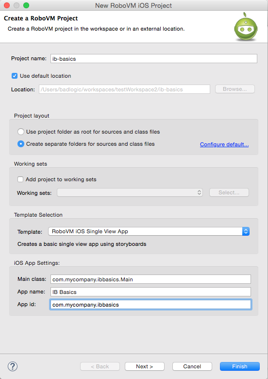
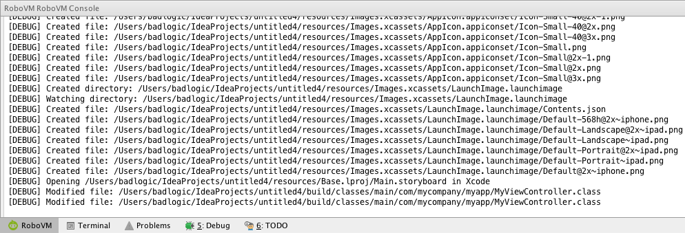
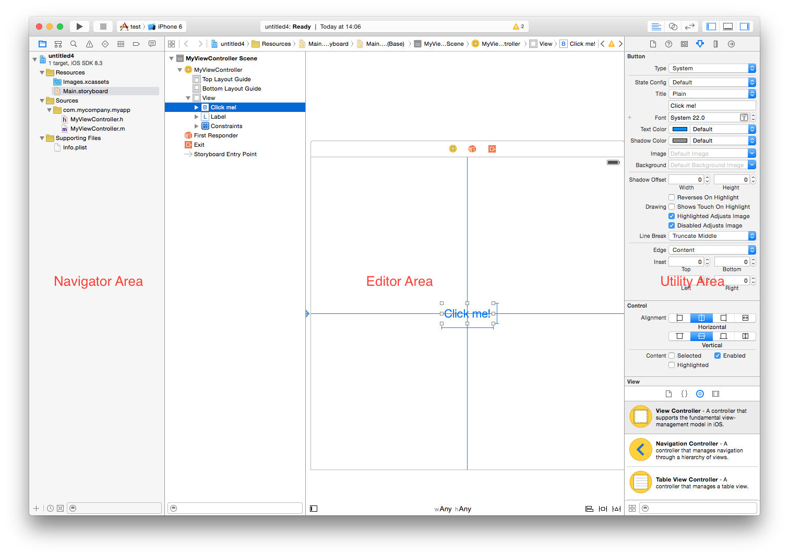
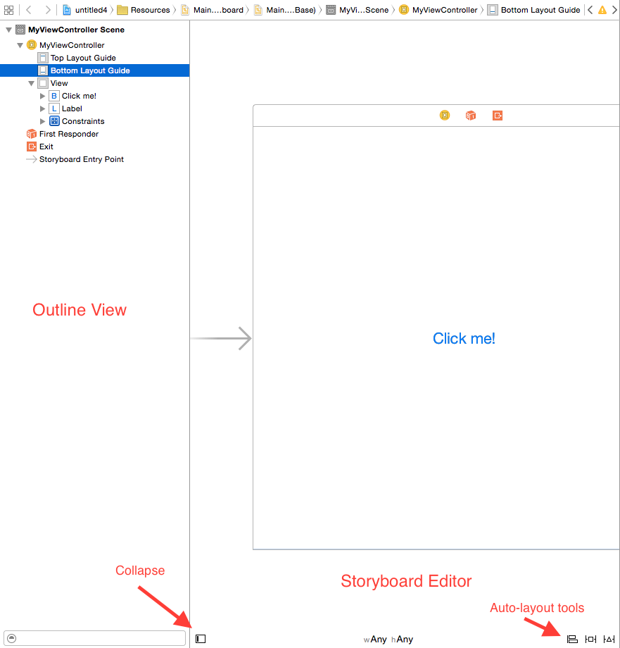
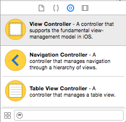
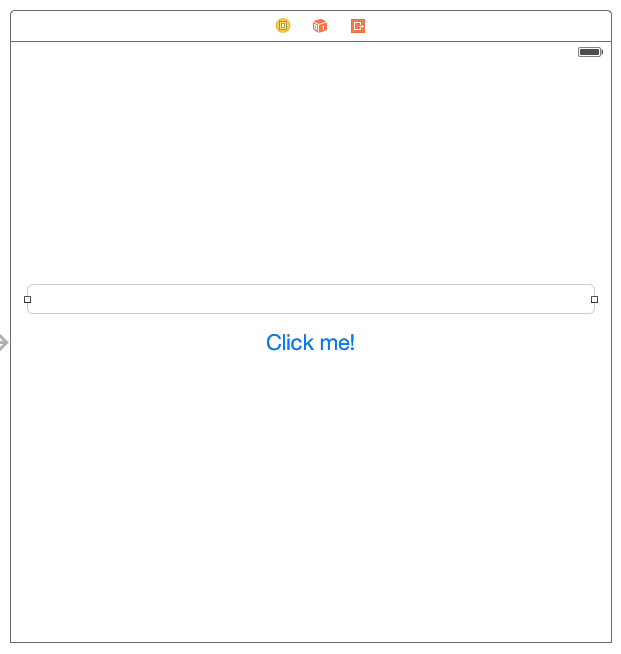
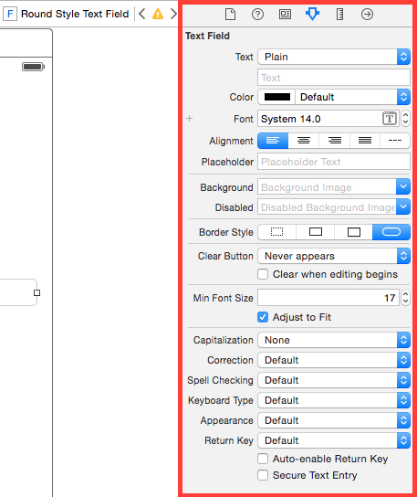

# Interface Builder Basics
> NOTE: You will need to have a valid license key to use Interface Builder integration. You can [sign up for a 14-day free trial](https://account.robovm.com/#/login) to test this feature.

This walkthrough takes you through the process of creating a simple user interface using [Interface Builder](https://developer.apple.com/xcode/interface-builder/) with RoboVM.

Interface Builder is part of Xcode and allows you to create the user interfaces of your iOS apps via a WYSIWYG editor. User interfaces are usually defined in so called __storyboards__. A single storyboard can contain multiple __scenes__, each corresponding to a specific screen of your application. A scene is controlled by a __view controller__ which interacts with __views__ within the scene, such as buttons, labels or text fields.

To accommodate different screen sizes, __[auto-layout](https://developer.apple.com/library/ios/documentation/UserExperience/Conceptual/AutolayoutPG/Introduction/Introduction.html)__ can be used which lets you define the relationships between your UI elements, such as their size, relative spacing and so forth.

At the end of the walkthrough you'll have an understanding of:

 * How to create storyboard-based RoboVM iOS App
 * How the project is structured
 * How the app is started
 * The basics of Xcode and the integrated Interface Builder
 * The basics of auto-layouts
 * How to wire up storyboards with Java code via actions and outlets

We will transform the boring template from this:


To this amazing application:


Our app will allow a user to enter her name and click on the `Click Me!` button to see a nice personalized greeting.

Before you continue with this walkthrough, we recommend going through the [Getting Started Guide](/getting-started/introduction.md) which shows you how to properly setup your development environment of choice.

## Creating the Project
The RoboVM plugins for Intellij IDEA and Eclipse both come with project templates that support Interface Builder.


### Intellij IDEA


1. Go to __ File -> New -> Project...___
2. In the dialog, select _RoboVM_ from the left hand list
3. Select _RoboVM iOS Single View App_ and click _Next_
4. Fill out the basic information about your app and click _Next_
5. Specify the name of your project and its location, click _Finish_

The RoboVM Plugin will then create your project with support for Interface Builder.

### Eclipse

1. Go to __File -> New -> RoboVM iOS Project__
2. In the dialog, specify your project's name
3. Select _RoboVM iOS Single View App_ template selection. 
4. Fill out the basic information about your app and click _Finish_. 

The RoboVM Plugin will then create your project with support for Interface Builder.

## Project Structure
The project structure of a storyboard-based project is similar to the structure of a code-only project, described in the [Getting Started Guide](/getting-started/structure.md).

The differences include:

1. The `Info.plist.xml` file contains a key named `UIMainStoryboardFile` specifying the name of the storyboard file that will get loaded on startup
2. [App icons](https://developer.apple.com/library/ios/documentation/UserExperience/Conceptual/MobileHIG/AppIcons.html) and [launch images](https://developer.apple.com/library/ios/documentation/UserExperience/Conceptual/MobileHIG/LaunchImages.html#//apple_ref/doc/uid/TP40006556-CH22-SW1) are located in `resources/Images.xcassets`
3. Storyboard files and other Interface Builder artifacts are located in `resources/Base.lproj/`

The project we created contains a storyboard file named `Main.storyboard`. It is referenced by the `Info.plist.xml` file under the `UIMainStoryboardFile` key with value `Main`.

## Code Structure & App Startup
The app consists of two classes: the main class and a view controller class. By using Interface Builder, both classes are significantly more simple compared to the code-only project from the getting started guide. 

### The Main class
Open the `Main.java` class:

```java
package com.mycompany.myapp;

import org.robovm.apple.foundation.NSAutoreleasePool;
import org.robovm.apple.uikit.UIApplication;
import org.robovm.apple.uikit.UIApplicationDelegateAdapter;
import org.robovm.apple.uikit.UIApplicationLaunchOptions;
import org.robovm.apple.uikit.UIScreen;
import org.robovm.apple.uikit.UIWindow;

public class Main extends UIApplicationDelegateAdapter {

    @Override
    public boolean didFinishLaunching(UIApplication application, UIApplicationLaunchOptions launchOptions) {
        return true;
    }

    public static void main(String[] args) {
        try (NSAutoreleasePool pool = new NSAutoreleasePool()) {
            UIApplication.main(args, null, Main.class);
        }
    }
}
```

The `UIApplicationDelegate` implementation does not explicitely setup any controllers or UI, as oposed to what was demonstrated in the [Getting Started Guide](/getting-started/structure.md) section. Instead, iOS will look into the `Info.plist.xml` file, find the `UIMainStoryboardFile` entry and automatically load the UI described by the file. On startup, your app will display the scene that is assigned to be the main entry point in the storyboard.

### The View Controller
Every scene in a storyboard has a `UIViewController` associated with it, responsible for implementing the logic of that scene. When the first scene of the main storyboard is loaded, iOS will also automatically instantiate the corresponding `UIViewController` associated with the scene.

Open the file `MyViewController.java`:
```java
package com.mycompany.myapp;

import org.robovm.apple.uikit.UILabel;
import org.robovm.apple.uikit.UIViewController;
import org.robovm.objc.annotation.CustomClass;
import org.robovm.objc.annotation.IBAction;
import org.robovm.objc.annotation.IBOutlet;

@CustomClass("MyViewController") // [:3:]
public class MyViewController extends UIViewController {
    private UILabel label;
    private int clickCount;

    @IBOutlet // [:1:]
    public void setLabel(UILabel label) {
        this.label = label;
    }

    @IBAction // [:2:]
    private void clicked() {
        label.setText("Click Nr. " + (++clickCount));
    }
}
```

[:1:] Instead of setting up views like labels and buttons itself, UI views defined in the storyboard scene will be injected into the view controller when the scene is loaded. This is achieved through __outlets__, which are simple setters/getters annotated with `@IBOutlet`. This allows us to get access to UI views from within our code.

[:2:] Instead of assigning listeners to views, like for receiving button clicks, the controller uses __actions__ to get notified about such events. This is achieved by annotating controller methods with the `@IBAction` annotation. This allows us to react to events of UI views from within our code.

[:3:] When designing interfaces with Interface Builder, we visually connect views and their events with outlets and actions of the view controller. In order for this to work, Interface Builder needs to know the view controllers Objective-C class name. This can be signified via the `@CustomClass` annotation, which lets you specify the name by which Interface Builder will refer to the view controller.

### Synchronizing the RoboVM Project with Xcode

Behind the scenes, RoboVM has to do additional work to make the bridge between your Java code and Interface Builder work:

* RoboVM creates an Xcode project with references to the `Info.plist.xml` file, resources and view controllers.
* RoboVM translates a controller's Java class, its actions and outlets into Objective-C header files. 
* RoboVM synchronizes changes between Xcode and your project bi-directionally, such as modifications to the `Info.plist.xml` file or changes to a view controller class.

All of this happens in the background. Every time you save changes to a relevant file in your project, RoboVM will update the Xcode or RoboVM project. You can catch a glimpse at this in the RoboVM console in Eclipse or IDEA:



## Xcode Basics

### Opening the Xcode Project
Both the RoboVM plugin for Eclipse and the plugin for Intellij IDEA allow you to open storyboard files from within the respective IDE.

* In Eclipse/IDEA, double click the `Main.storyboard` file in the `resources/Base.lproj/` folder _OR_ 
* In Eclipse/IDEA, right clicking your RoboVM module/project and selecting _Open Xcode Project_ from the context menu.



1. The __Navigator Area__ allows you to view the files within your Xcode project.
2. The __Editor Area__ displays the content of a file selected in the navigator area, using a content type specific UI.
3. The __Utility Area__ displays various properties of a selected object. An object can be a file selected in the navigator area or a UI view selected in the storyboard editor.

You can collapse the navigator and utility areas via the toolbar in the top right corner of Xcode


### Viewing a Storyboard
Select the storyboard file in the navigator. The editor area will show you a WYSIWYG editor with the contents of the storyboard:



1. The __Outline View__ shows the contents of every scene in the storyboard in form of a tree. It is collapsable via the button in the bottom right corner.
2. The __Canvas__ allows you to visually modify your scenes.
3. The __Auto-layout Tools__ allow you to apply layout constraints to your UI elements.

You can select view controllers, views, and constraints either by selecting them in the outline view or canvas.

You can delete elements by selecting them in either the ouline view or the canvas and hitting the delete key.

You can zoom and pan the canvas using your mouse or touchpad. You can drag scenes around the canvas freely.

### Adding a View to a Scene
To add a new view to a scene in the storyboard, go to the __Object Library__ at the bottom of the utility area:



You can find various standard UI elements in there, like buttons, labels, text fields and so on. To add an element to your storyboard, simply drag it from the object library onto a scene in the canvas.

We want our user to be able to enter her name.

Add a text field to the scene:

1. Type `text` into the search bar at the bottom of the object library
2. Drag the text field from the object library onto the camera
3. Position the text field above the button, centering it horizontally by using the blue guides that appear
4. Resize the text field to the left and right edge of the scene. Stop when you hit the blue padding guides on the left and right side.

The result should look something like this:



### Modifying View Properties
Once an element is selected, you can view and modify its properties in the __Inspector Pane__ in the utility area:



Via the inspector you can change view type dependent properties, such as font, color, background images and so forth.

We want to indicate to our user that she has to enter her name in order for brilliant things to happen.

Modify the font size, add a placeholder text to the text field, and set a default text on the label:

1. Select the text field in the outline view or in the canvas
2. In the inspector, set the `Placeholder` property to `Your name here`
3. In the inspector, click the T-icon on the font property and change the size to 24
4. Select the label in the outline view or in the canvas
5. In the inspector, set the text field beneath the `Text` combo box to `I do not know you!`

The result should look something like this:


### Previewing your UI
One way of previewing your UI is to start your app on a simulator or device. Another way to quickly preview you UI is to use the __Assistant Editor__ functionality:

1. Click on the assistant editor button in the top left toolbar

  

2. In the breadcrump part of the assistant editor, select the first crump, then select `Preview (1)`, then select your storyboard file

  

You will see something like this:


Click on the plus icon in the bottom left corner of the preview to add other device types.

Select a device and click the rotate button at it's bottom to switch between portrait and landscape.

Delete a device by selecting it and then pressing the delete key.


> NOTE: Previews are nice while iterating on your UI, but you should always test on a simulator or device. To run your app on a simulator or device, switch back to your Java IDE and run it from there. Running your app via Xcode is not supported.

### Applying basic auto-layout constraints
Our app doesn't look great in the preview because the constraints on the UI views are not what we want. Let's try to fix this.

Interface Builder helps you design UIs for different screen sizes via auto-layout. Auto-layout uses __contraints__ size and position your UI views. A constraint puts the position and/or size of a UI view in relation to something else. This can be the views content, another UI view to which it should be placed relatively to and so on.

Before applying contraints, let's define how our scene should look like:

* The `Click Me!` button should be centered vertically and horizontally. 
* The text field should be centered horizontally. It's left and right edges should be pinned to the left and right edges of the super view (which stretches the whole screen), with some spacing. It should also be placed relative to the top of the button, again with some spacing.
* The Label should be centered horizontally, it's left and right edges should be pinned to the left and right edges of the super view with some spacing, and it should also be placed relative to the top of the super view with some spacing.

Let's start by removing all constraints:

1. In the canvas or outline view, select one of the views
2. In the canvas, click the `Resolve Auto Layout Issues" button
3. From the context menu, select 'Clear Constraints' from the `All Views in My View Controller` category
 

You should not see any constraints in the outline view anymore.

To center the `Click Me!` button vertically and horizontally:

1. Select the button in the canvas or outline view
2. In the canvas, click the 'Align' button
3. From the context menu, check the `Horizontal Center in Container` and `Vertical Center in Container` checkboxes
 
 
4. Click the `Add 2 Constraints` button

The canvas will now look like this:
 

The blue lines indicate that this UI view has a horizontal and vertical centering constraint applied.

The red and orange boxes tell us that there is something wrong with the auto-layout of this view. Let's find out what the problem is.

In the last step we applied new constraints to the button. This changed the button's location and size according to the auto-layout calculations. However, the location and size of our button on the canvas is different to the properties calculated by auto-layout. Interface Builder indicates this problem by:

1. Showing orange guides and rectangles in the canvas for the element that has a problem
2. Showing a yellow, orange or red arrow icon in the outline view


Click on the arrow icon:


Interface Builder tells us that the button is misplaced on the canvas. It expects a different position on the x-axis as well as a different width compared to what is currently visible in the canvas. Interface Builder can help you to automatically resolve this issue. 

Click on the triangle to the right of the issue:


Interface Builder suggests the most probable fix for the issue. The location and size of a UI view are stored in what is called a __frame__. The frame as calculated by auto-layout is different to the frame of the button on the canvas. Interface Builder suggests to update the frame of the button to match the frame as calculated by the auto-layout calculations.

Click the `Fix Misplacement` button.

The red and orange outlines on the button are gone, and so is the arrow indicating auto-layout issues!

> NOTE: when you place or otherwise modify a UI view, always check for orange/red outlines or guide lines as well as that little arrow in the outline view. Resolve auto-layout issues as early as possible!

Let's position the text field relative to the button's top edge and the super view's edges:
1. Select the text field in the canvas or outline view
2. In the canvas, click the `Pin` button
3. From the context menu, click the left, right and bottom edges
4. Click the `Add 3 Constraints` button
 
 

The result will look like this:


The blue guide lines on the left and right represent our pining constraint to the super view's edges, including margins. The little blue guide line between the text field and the button indicates that the text field will move with the button vertically, always keeping the set distance of 9 points.

Finally, let's layout the label.
1. Select the label in the canvas or outline view
2. In the canvas, click the `Pin` button
3. From the context menu, click the left, right and top edges
4. Enter `0` for the left and right edges
4. Click the `Add 3 Constraints` button


Since we pinned the label to the left and right margin of the super view, the label's frame as calculated by auto-layout is different from its frame on the canvas. Interface Builder indicates this via the small badges with the text `+144`. We can resolve this just as we resolved the frame issue previously:

1. Click the yellow arrow in the outline view
2. Click the triangle next to the issue
3. Select `Update Frame`, then click `Fix Misplacement`

Preview the app in the assitant editor for a few device types:


This looks what we wanted!

### Specifying a Scene's View Controller
`My View Controller` is not really descriptive, so let's change it to something else:

1. In Eclipse/IDEA, open `MyViewController.java`
2. Rename the class to `GreetingsController` (make sure the file is renamed as well)
3. Change the `@CustomClass` annotation to `GreetingsController`

```java
package com.mycompany.myapp;

import org.robovm.apple.uikit.UILabel;
import org.robovm.apple.uikit.UIViewController;
import org.robovm.objc.annotation.CustomClass;
import org.robovm.objc.annotation.IBAction;
import org.robovm.objc.annotation.IBOutlet;

@CustomClass("GreetingsController")
public class GreetingsController extends UIViewController {
    private UILabel label;
    private int clickCount;

    @IBOutlet
    public void setLabel(UILabel label) {
        this.label = label;
    }

    @IBAction
    private void clicked() {
        label.setText("Click Nr. " + (++clickCount));
    }
}

```

Once you save your changes, RoboVM will update the Xcode project accordingly.

> NOTE: Intellij IDEA does not compile classes automatically when you change the source files. See the [Getting Started Guide for Intellij IDEA](/getting-started/intellij.md) on how to configure this behaviour!

Open Xcode, expand the `Sources` and click on the `GreetingsController.h` file. It will open in the editor area.

```objc
/**
 * GreetingsController.h
 * 
 * This file has been auto-generated by
 * RoboVM's Interface Builder Integrator.
 * DO NOT MODIFY!
 */

#import <UIKit/UIKit.h>

@interface GreetingsController : UIViewController

/**
 * IBOutlet label
 */
@property (weak, nonatomic) IBOutlet UILabel *label;

/**
 * IBAction clicked
 * Selector: clicked
 */
-(IBAction) clicked;

@end
```

This file was auto-generated by RoboVM when you saved your modifications to the Java class in the IDE. It's what allows Interface Builder to get to know about our controllers, their outlets, and their actions.

Since we changed the name of the view controller, we need to reassign it to our scene:
1. In Xcode, open the `Main.storyboard` file by clicking on it in the navigator
2. Select the view controller in the canvas by clicking the scene's title bar, or in the outline
3. In the utility area, open the __Identity Inspector__
 
 

4. In the class field, specify `GreetingsController`. You can select it from the drop-down

When iOS loads our application, it will first load the main storyboard, which in turn will load our scene and trigger the instantiation of our `GreetingsController` class, both on the native and on the Java-side!

> NOTE: the constructors of view controllers instantiated via storyboards are currently not called. To initialize your controllers, override the `viewDidLoad()` method and perform any setup there. You can follow the progress on this issue on the [issue tracker](https://github.com/robovm/robovm/issues/894)

### Adding Outlets
We will need access to the text field from within our Java-based view controller. To achieve this, we need to create an outlet on the view controller.

Add the following code to `GreetingsController`:
```java
	private UITextField textField;

    @IBOutlet
    public void setTextField(UITextField textField) {
        this.textField = textField;
    }
```

To define an outlet in your Java-based view controller, create a setter (and optionally a getter) method following the Java bean naming conventions, annotated with `@IBOutlet`. The setter method must take exactly one parameter of the type of the UI view you want to assign to the outlet. In this case, the type is `UITextField`. In case of the label, the type is `UILabel`. You can also specify a super type, like `UIView`. The optional getter must not take any parameter and return a type according to the same typing rules as for the setter.

After you save the Java source file, RoboVM will update the corresponding Objective-C header file `GreetingsController.h`:

```objc
/**
 * IBOutlet textField
 */
@property (weak, nonatomic) IBOutlet UITextField *textField;
```

RoboVM added a property to header file. The Java setter name is stripped of the `set` prefix and used as the name for the outlet in the Objective-C header.

Let's assign the text field to this outlet:
1. In Xcode, select the view controller in the outline view or canvas
2. Open the __Connections Inspector__
 
2. Click on the port next to the `textField` outlet and drag a line to the text field on the canvas or in the outline view
 

The text field is now assigned to the outlet in our controller:
 

You can remove the assignement by clicking on the `x` in the connections inspector.

Let's start the app and see if the outlet is assigned:
1. In Eclipse/IDEA set a breakpoint in the `GreetingsController#setTextField` method
2. Create a run configuration for the simulator or device
3. Start the run configuration in debug mode

And indeed, the breakpoint is hit, and the passed in `UITextField` is the one we defined in the storyboard:


### Adding Actions
Our Java-based view controller also has to react to events, such as a click on a button or when the content of a text field changes. We want to process changes to the text field value in addition to clicks on the `Click Me!` button. To achieve this, we need to create an action on the view controller.

Add the following code to the `GreetingsController`:
```java
    @IBAction
    private void textChanged() {
        label.setText("I see you typing!");
    }
```

To define an action in your view controller, create a method annotated with `@IBAction`. The method can have one, two or zero parameters. The first optional parameter is the sender of the event, e.g. our `UITextField`. The second optional parameter is a `UIEvent` which holds additional data for the event. In our case we went for the zero parameter action.

After you save your Java source file, RoboVM will update the corresponding Objective-C header file `GreetingsController.h`:

```objc
/**
 * IBAction textChanged
 * Selector: textChanged
 */
-(IBAction) textChanged;
```

RoboVM added a method to the header file. The Java method name is used as the name for the action.

Let's assign the text change event of the text field to this action:
1. In Xcode, select the view controller in the outline view or canvas
2. Open the connections inspector
3. Click on the port next to the `textChanged` outlet and drag a line to the text field on the canvas or in the outline view
  

4. From the popup dialog select `Editing Changed`
 

The text changed event is now assigned to the action in our controller:
 

When the user types in the text field, the `GreetingsController#textChanged()` method will be called:

## Finishing Touches
Our app is almost complete. The only thing left to do is changed the controller code such that we assign a greeting text to the label when the `Click Me!` button is pressed. The final code of `GreetingsController` looks like this:

```java
package com.mycompany.myapp;

import org.robovm.apple.uikit.UILabel;
import org.robovm.apple.uikit.UITextField;
import org.robovm.apple.uikit.UIViewController;
import org.robovm.objc.annotation.CustomClass;
import org.robovm.objc.annotation.IBAction;
import org.robovm.objc.annotation.IBOutlet;

@CustomClass("GreetingsController")
public class GreetingsController extends UIViewController {
    private UILabel label;
    private UITextField textField;

    @IBOutlet
    public void setTextField(UITextField textField) {
        this.textField = textField;
    }

    @IBOutlet
    public void setLabel(UILabel label) {
        this.label = label;
    }

    @IBAction
    private void clicked() {
        String name = textField.getText();
        if (name.isEmpty()) {
            name = "Unknown";
        }
        label.setText("Hello " + name + "!");
    }

    @IBAction
    private void textChanged() {
        label.setText("I see you typing!");
    }
}
```

Our application looks like this:


## Conclusion
In this walkthrough you got to know the basics of RoboVM's Interface Builder integration. Using storyboards results in very concise code. Modifying the UI visually is also a lot easier than coding it by hand. Finally, you did not have to touch any Objective-C code, RoboVM took good care of that!

With your new knowledge, you can now check out the other walkthroughs as well as Apple's official documentation!
